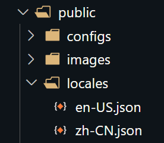
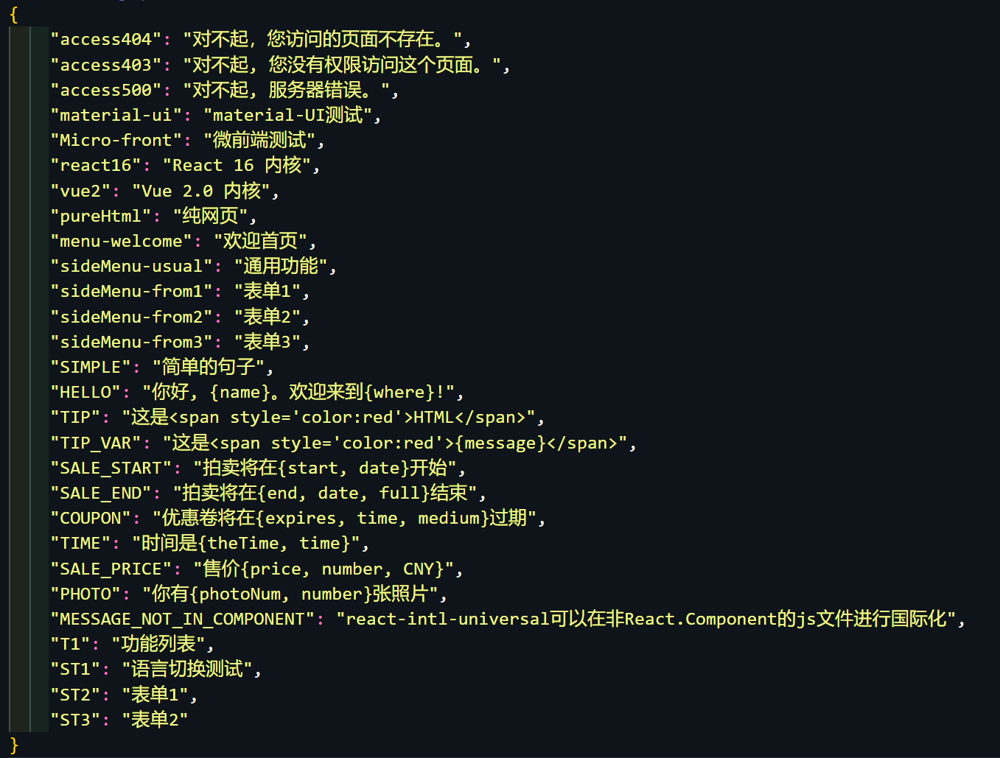

## **国际化**

本框架内置了国际化插件，可以轻松地将国际化功能集成到你的应用程序之中。

### 开始使用

#### 编写配置文件

在 `public/locales` 目录下，创建多语言配置文件。如下：


内容格式举例如下：


#### 项目多语言初始化

在项目入口处，先加载多语言配置再渲染路由。

可实现一个自定义加载器组件，具体组件实现举例如下：

```
import React from 'react';
import { useIntl } from '@fedx-web-common/react-hooks';
import PageLoading from '../PageLoading';

function LocaleLoader({ children }) {
    // 默认加载中文，具体默认值见后续介绍
    const { localeLoaded } = useIntl();

    return localeLoaded ? children : <PageLoading />;
}

export default LocaleLoader;
```

在项目入口处引入加载器组件，如下：

```
import LocaleLoader from './components/LocaleLoader';

<LocaleLoader>
    <Router>
        // ...
    </Router>
</LocaleLoader>
```

### 使用方法

基础使用实例如下：

```
import React from 'react';
import { intl } from '@fedx-web-common/react-hooks';

const Example = () => {
    const name = 'Jim';
    return (<div>
                <Button>{intl.get('key',{name})}</Button>
                <Button>{intl.formatMessage({ id:'hello', defaultMessage: `Hello, ${name}`}, {name})}</Button>
            </div>
    );
}

export default Example;
```

### 切换语言

可以通过以下几种方式切换语言。

- changeCurrentLocale 方法

| 参数         | 类型      | 介绍                                       |
| ------------ | --------- | ------------------------------------------ |
| `lang`       | `String`  | 切换到的语言                               |
| `realReload` | `Boolean` | 切换时是否刷新页面，默认为 `true` 刷新页面 |

```
import { useIntl } from '@fedx-web-common/react-hooks';

function changeLocale(lang: string) {
    const { changeCurrentLocale } = useIntl();

    changeCurrentLocale(lang, true);
}

export default LocaleLoader;
```

- 通过语言设置参数：lang

语言设置的优先级为：url 查询参数 > cookie > localStorage

### 多语言默认值

#### 默认语言

内置语言默认值为`zh-CN`。

#### 获取多语言内容默认值

为了页面的一致性，当框架没有在当前的多语言文件中找到 id 对应的内容时，它会直接将 id 渲染为页面上的内容。
